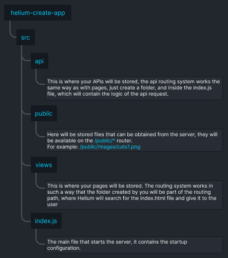

## Helium

## What is Helium

Helium is a framework that provides you with everything you need to develop modern web applications. It is a combination of frontend and backend functionality, allowing you to develop applications without unnecessary complications.

Helium is aimed at creating simple and easy-to-use web applications

### Main advantages

* **Mixing Frontend and Backend**: Helium integrates both parts, providing unified interaction between them.

* **Simplicity and Convenience**: Helium provides tools that simplify development without overwhelming you with unnecessary details.

* **Intuitive Routing**: Helium provides a routing system based on directory organization. This allows you to easily structure your routing, making the navigation process more logical and clear.

## How to use

*Actual only at the time of ALPHA version of the framework, the process will be greatly simplified in the future!*

Download and unzip `helium-create-app`, this repository acts as the framework structure

Since Helium is not currently available as an npm package, you can download it to your device and connect it to [**helium-create-app**](https://github.com/ShizzaHo/helium-create-app) as a directory link via ```npm link %path_to_helium%```.

After that type ```npm install``` to install the dependencies, do this in both the **Helium** kernel and **helium-create-app**

Then you can use the ```npm start`` command to start the project.

## How it works

The **Helium** core is based on the **Express.js** library, providing a robust and efficient framework for developing your web applications. This means you get all the power and flexibility of **Express.js**, complemented by the unique features provided by **Helium**.

A key feature is intuitive routing, you can organize routes as directories, which makes the structure of your application more logical and easy to navigate. For example, creating a new page in your application will be associated with the creation of a new directory containing the corresponding component, style and data files. 

### Documentation

### Visual project structure



On the image you can see the project structure followed by **Helium**, you can create exactly the same structure without downloading **helium-create-app**, the main thing is to correctly configure **Helium** connection in your **index.js** file.

### Structure of the views folder and creation of a new page

Inside the **views** folder there should be two mandatory files **index.html** and **template.html**.

**template.html** contains a template of the starting page structure, which will be used by **Helium** to generate pages that it will give to the user.

This template also contains two special keys, which are necessary for content generation

* **%HEAD%** - Content that will be added to the ``<head>`` tag of the page.

* **%BODY%** - Content to be added to the ``<body>`` tag of the page.

The absence of a key is allowed, but you will receive a warning message in the console about the absence of the key.


**index.html** will act as a start page that will be called by route: **/** (for example: http://localhost:3000/)


On the example of **index.html** you can see the structure of the application page, it is very similar to the usual structure of the html document, but without unnecessary tags, everything inside ``<head>`` and ``<body>`` tags will be inserted instead of **%HEAD%** and **%BODY%** key in the **template.html** template.

Creation of a new page is based on the principle of creating a folder, which represents a part of the route on your site and creating **index.html** inside it, so **Helium** will understand that this page should be displayed along the route.


For example, we have created **test** folder inside **views** folder and created **index.html** file in it, now **Helium** will understand that it is necessary to create a page by route **/test/** (for example: http://localhost:3000/test/) where the generated content from **index.html** will be displayed.

### Structure of api folder and creation of a new api request

Later...

### How the main index.html file works

later...

### Configuration of the main index.html file

later...

### How to work with Single Page Application mode

later...