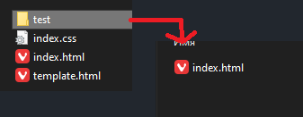

# Helium

## Что такое Helium

Helium это фреймворк который обеспечит вас всем необходимым для разработки современных веб-приложений. Он представляет собой сочетание frontend и backend функциональности, позволяя разрабатывать приложения без лишних сложностей.

Helium нацелен на создание простых и удобных web-приложений

### Основные преимущества

* **Совмещение Frontend и Backend**: Helium интегрирует обе части, обеспечивая единое взаимодействие между ними.

* **Простота и Удобство**: Helium предоставляет инструменты, которые упрощают разработку, не перегружая вас лишними деталями.

* **Интуитивный роутинг**: Helium предоставляет систему маршрутизации, основанную на организации директорий. Это позволяет легко структурировать вашe маршрутизацию, делая процесс навигации более логичным и понятным.

## Как пользоваться

*Актуально только на момент ALPHA версии фреймворка, в будущем процесс сильно упростится!*

Скачайте и распакуйте `helium-create-app`, этот репозиторий выступает в роли структуры фреймворка

Поскольку пока Helium на данный момент нет в виде npm пакета, вы можете скачать его на свое устройство и подключить его к [**helium-create-app**](https://github.com/ShizzaHo/helium-create-app) в виде ссылки на директорию через ```npm link %path_to_helium%```

После этого введите ```npm install``` для установки зависимостей, сделайте это как в ядре **Helium** так и в **helium-create-app**

Далее вы можете использовать команду ```npm start``` для запуска проекта

## Как работает

Ядро **Helium** основано на библиотеке **Express.js**, обеспечивая надежную и эффективную основу для разработки ваших веб-приложений. Это значит, что вы получаете всю мощь и гибкость **Express.js**, дополненную уникальными возможностями, предоставляемыми **Helium**.

Ключевой особенностью является интуитивный роутинг, вы можете организовывать маршруты в виде директорий, что делает структуру вашего приложения более логичной и удобной для навигации. Например, создание новой страницы в приложении будет ассоциироваться с созданием новой директории, содержащей соответствующие файлы компонентов, стилей и данных. 

## Документация

### Наглядная структура проекта


На изображении вы можете увидеть структуру проекта которую придерживается **Helium**, вы можете создать точно такую же структуру без загрузки **helium-create-app**, главное правильно настройте подключение **Helium** в вашем файле **startup.js**.

### Структура папки views и создание новой страницы

Внутри папки **views** должны находиться два обязательных файла **index.html** и **template.html**.

**template.html** содержит шаблон стартовой структуры страницы, которую в дальнейшем **Helium** будет использовать для генерации страниц которые он отдаст пользователю.

В этом шаблоне также присудствуют два специальных ключа, которые нужны для генерации контента

* **%HEAD%** - Содержимое которое будет добавлено в ``<head>`` тег страницы

* **%BODY%** - Содержимое которое будет добавлено в ``<body>`` тег страницы

Отсутвие того или иного ключа допускаемо, однако вы будете получать предупредительное сообщение в консоль об отстутвии ключа.


**index.html** будет выступать в роли стартовой страницы которая будет вызывается по маршруту: **/** (например: http://localhost:3000/)


На примере **index.html** вы можете увидеть струкруру страницы приложения, она очень похожа на обычную структуру html документа, колько без лишних тегов, все что находится внутри ``<head>`` и ``<body>`` тегов будет вставлено в вместо **%HEAD%** и **%BODY%** ключа в шаблоне **template.html**

Создание новой страницы происходит по принципу создания папки, что олицетовряет часть маршрута на вашем сайте и создание внутри него **index.html**, таким образом **Helium** будет понимать что эту страницу нужно отобразить по маршруту.



К примеру мы создали папку **test** внутри папки **views** и создали в ней файл **index.html**, теперь **Helium** будет понимать что нужно создать страницу по маршруту **/test/** (например: http://localhost:3000/test/) в котором и будет отображено сгенерированное содержимое из **index.html**.

### Структура папки api и создание нового api запроса

позже...

### Как работает главный index.html файл

позже...

### Конфигурация главного index.html файла

позже...

### Как работать с Single Page Application режимом

позже...